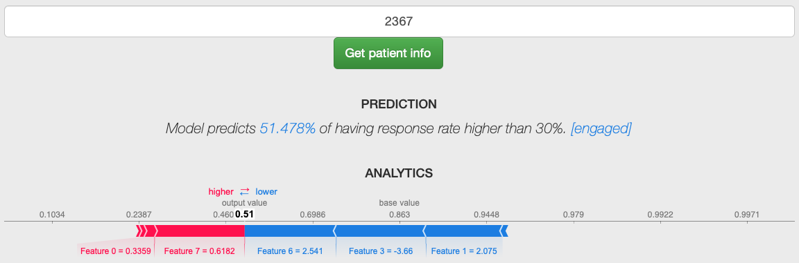

# [Predictive ML Model for Patient Engagement]

### Problem Statement

In healthcare, patient engagement is an essential part of both providers and patients to work together to improve health. During the entire decision-making process based on a patient's health conditions, the more the patient remains engaged in the process, the much more reliable decisions can be made according to patient's data been recorded during this process. Besides, patients who are actively keeping themselves engaged in the process tend to be healthier and lead to better health outcomes compared to those who are not.

With the application of today's AI/ML techniques, we are able to enhance patient engagement solutions and care management services. Some popular parts include:

1. Understand patient behavior
2. Respond to patients in a timely manner
3. Personalized and intelligent decisions for patients

The **goal** is to ***identify risky patients who intend to be dropping off after 2 months of engagement to the company's remote health monitoring system.*** With ML approaches, the company can have a clear view of what the underlying probability is like and what potential factors are for patients who will drop off, then those predicted drop-off patients will be reached out by the PES team to prevent dropping off.

Questions that will be explored and answered in this project include:

1. What are risky patients who will drop off after 2 months?
2. What are some main reasons to cause drop-off?
3. What is the probability of dropping off for each patient?

All of these questions will be answered in the section Implication & Patient Outcomes.

### Success Metrics

1. Metrics on Test Set:

2. ROC Curve:

### Constraints

- Patients with zero response rates all the time in the 2-month time window will automatically be treated as a dropping-off group.
- Patients who are only being active on the system for less than 2 months are not included in this model. In other words, patients must continuously have data records for 2 months.

...

### Risks

- Although there are a large number of patients enrolled on the remote monitoring system, only around 43.65% of the entire engagement population will be active on the system for longer than 2 months (count from the start date)
- Machine Learning will outperform with large enough data and good data quality. Patients who are having too many zero engagement activities on the system are useless and most likely will lead to a biased model.

### Implication & Patiemt Outcomes

The predictive model is then deployed as a Flask APP and can be accessed through running as a localhost. Pass in a patient ID existing in the database, then model prediction and insights will be returned.

#### 8 Primary Features & 54 Sub-features

There are 8 primary features (Feature 0 to Feature 7) and 54 sub-features. The relationship between the two is that each of those primary features includes 54 sub-features. Based on each individual, the model gives out the importance of the 8 primary features, then we can dig into the 54 sub-features of the most important primary feature.

The threshold of engagement and drop-off is 50% as default and can not be changed. In other words, patients with a predicted result greater than 50% will be treated as engaged, while for a patient with a result lower than 50% will be classified as dropping-off.

#### Chart in ANALYTICS

For those 8 primary features, red-colored ones are features pushing the prediction towards 100%, while blue colored ones are features dragging the prediction back to 0%. An analogy for this: red feature represents hot water, blue feature represents cold water, together they two adjust the temperature of a cup of water between 0°C to 100°C.

#### Flask APP

The model is then deployed as a web app via Flask, the main web page is like the following picture.

#### Insights

1. Predicted dropping-off patient:
    - The model predicts a patient with ID 2392 a 6.791% probability of having a response rate lower than 30%, and Feature 0 is most likely the main reason for leading to a high dropping-off rate as shown in ANALYTICS section.
    
    - Feature 0 can be explored in the following histogram. Importance scores are sorted from high(left) to low(right), and features in the left are more important than those in the right. For example, 2-month response rates & rating scores in survey quality & alert counts & number of alerts been read are several main factors that lead to a low response rate for a patient with ID 2392.
    

2. Predicted engaging patient:
    - The model predicts a patient with ID 23861 a 72.503% probability of engaging.
    
    - Feature 4 is the most important one for letting the model make the decision. The number of sessions is responded in advance & response duration are 2 crucial factors contributing to keeping patient engaged. From the original patient info, it shows that this patient has a very low response duration around 100 seconds, which indicates he/she is actively interacting with the system.
    

3. Predicted engaging patient but with a potentially high dropping-off rate:
    - Model predicts patient with ID 2367 a probability of 51.478% engaging rate on the system. 
    
    - Feature 7 is the leading factor. As the chart showed blow, the number of alerts & the number of alerts been read & response duration are some main indicators contributing to keeping patient engaging.
    
    - However, this patient is on the edge of engaging (51.478% is very close to 50% threshold), and Feature 6 is the factor that drags the patient to drop off. We can see from the blow char that age is the essential reason, so we may guess maybe this patient is in the group of the older population. After checking the patient info, it shows that this patient is within [65, 75] age range.
    